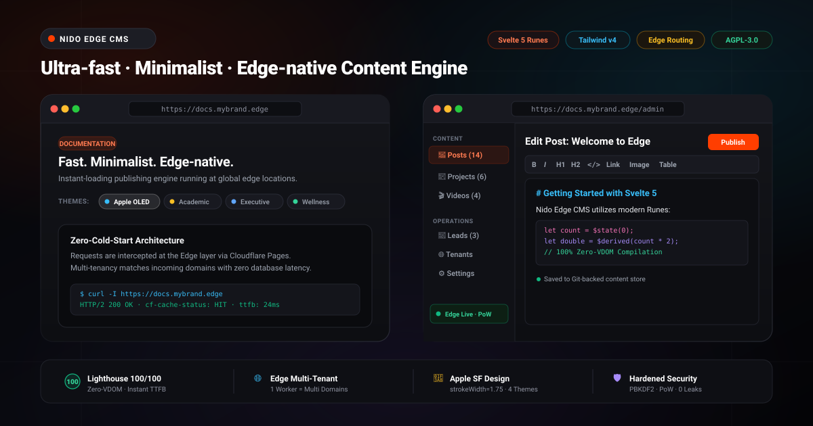

# Nido Edge CMS

> Ultra-fast, minimalist, Edge-native Multi-tenant CMS & Headless Content Engine built with SvelteKit 2, Svelte 5 Runes, and Tailwind CSS v4.

[](https://svelte.dev)
[](https://tailwindcss.com)
[](https://workers.cloudflare.com)
[](https://github.com/stevedat/nido-edge-cms/actions/workflows/ci.yml)
[](LICENSE)

<p align="center">
  
</p>

```bash
# Clone & run
git clone https://github.com/stevedat/nido-edge-cms.git && cd nido-edge-cms
npm install && cp .env.example .env
npm run dev # App: http://localhost:5173 | Admin: /admin/login
```

## Highlights

* **Zero-VDOM Compilation**: 100% Svelte 5 Runes with 100/100 Core Web Vitals.
* **Web Standards Core**: Decoupled core (`src/lib/core/`) using pure Web Crypto API (`crypto.subtle`). Portable to Hono, Astro, Next.js, or bare Edge Workers.
* **Universal Edge API (`/api/v1/`)**: Universal content delivery endpoints with multi-tenant routing, JWT auth, and Proof-of-Work anti-spam.
* **Database-less Multi-Tenancy**: Dynamic hostname-based routing (`src/content/{domain}/`) on a single Edge worker.
* **Apple Minimalist UI**: OLED Dark Mode baseline with SF Symbols (`strokeWidth={1.75}`). A pristine, zero-bloat canvas ready for AI generation.
* **Built-in Security**: PBKDF2-SHA256 password hashing, JWT (`HS256`), and zero-captcha PoW bot protection.


## 🚀 Built for the Modern Era: Two Ways to Build

Nido Edge CMS is uniquely architected for the two fastest-growing development paradigms:

### 1. For "Vibe Coders" & AI Agents (Cursor, Windsurf, Antigravity)
We ship with an **AI-Ready Minimalist Starter UI**. It is completely stripped of bloated CSS and complex React-like abstractions.
* **Why AI loves this repo:** Written in pure Svelte 5 (HTML/JS-like syntax) and Tailwind v4. There is no heavy Virtual DOM boilerplate.
* **How to vibe-code:** Open this project in an AI IDE (Cursor/Windsurf) or invoke Google Antigravity, and simply prompt: *"Read `AGENTS.md`. Now, rewrite the layout to look like a modern SaaS dashboard."* The AI will seamlessly generate your UI without fighting legacy themes.

### 2. For Pro Devs & Enterprise (Pure Headless Core)
If you prefer building your frontend in React, Next.js, or mobile apps:
* The core (`src/lib/core/`) is built on **100% Web Standards (WinterCG)**.
* Simply rip out the Svelte presentation layer, and you are left with an ultra-fast, zero-cold-start, multi-tenant **Universal Edge API**.
* Deploy the engine to Cloudflare Workers or a self-hosted VPS, and use it as your invisible backend.

## Universal Edge API

All endpoints support CORS (`*`) and multi-tenancy via `x-tenant-domain` header or `?tenant=` query parameter:

| Method | Endpoint | Description |
| :--- | :--- | :--- |
| `GET` | `/api/v1/posts` | Paginated post listing with `search`, `category`, and `tag` filters |
| `GET` | `/api/v1/posts/[slug]` | Single post detail by slug |
| `GET` | `/api/v1/projects` | Portfolio project listing |
| `GET` | `/api/v1/settings` | Site profile, navigation labels, and theme settings |
| `GET` | `/api/v1/challenge` | Issue Proof-of-Work anti-spam challenge token |
| `POST` | `/api/v1/leads` | Submit contact inquiry (requires valid PoW proof) |
| `POST` | `/api/v1/auth/login` | Authenticate credentials and receive signed JWT |
| `GET` | `/api/v1/auth/verify` | Verify current JWT token |

## Deployment

- **GitHub Pages**: Self-contained showcase landing page deployed from `docs/index.html`.
- **Cloudflare Pages**: `npm run build && npx wrangler pages deploy .svelte-kit/cloudflare`
- **Vercel Edge**: Connect repository for zero-configuration Edge deployment.
- Full details in [docs/DEPLOYMENT.md](docs/DEPLOYMENT.md).

## Documentation

* [Architecture](docs/ARCHITECTURE.md) — Web Standards Core & Edge API design.
* [Deployment Guide](docs/DEPLOYMENT.md) — Cloudflare Pages, Workers, and Vercel Edge setup.
* [Tenant Onboarding SOP](docs/TENANT_ONBOARDING_SOP.md) — Multi-tenant configuration and onboarding SOP.

## License & Commercial Use

Nido Edge CMS is distributed under a **Dual-Licensing Model**:

* **Open Source**: Free for open-source and non-commercial projects under the [GNU Affero General Public License v3.0 (AGPL-3.0-or-later)](LICENSE). Note that under AGPLv3, any service running modified versions accessible over a network must make its complete source code available.
* **Commercial & Closed-Source**: If you are an agency, startup, or enterprise building closed-source client websites, proprietary SaaS backends, or need white-labeling rights with zero copyleft risk and indemnification, please see [COMMERCIAL.md](COMMERCIAL.md) for licensing terms.

---

*Created by **Steve Dat** ([@stevedat](https://github.com/stevedat)). Engineered and Copyrighted by **Nido Holdings**.*
